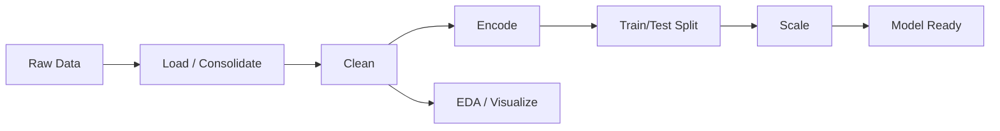

# Data Types, Dataset Structure, and Preprocessing & Visualization

This class document introduces foundational concepts and practical techniques for working with data before building machine learning models. You will learn about **data types**, **dataset structure**, **cleaning**, **processing**, and **visualization**, with concrete examples from the notebooks in this folder and from the Hands-On Machine Learning California Housing example. Use this as a reading guide and open the referenced notebooks alongside to follow the code.

---

## 1. Foundational Concepts

### 1.1 Data types (variable types)

Understanding the type of each column in your data determines how you clean, encode, scale, and visualize it.

- **Numeric**
  - **Continuous:** values on a continuous scale (e.g. salary, age, median income). Often need scaling and can be plotted with histograms or scatter plots.
  - **Discrete:** countable values (e.g. number of rooms, count of orders). May be treated as numeric or sometimes binned for analysis.
- **Categorical**
  - **Nominal:** categories with no natural order (e.g. country, city, product name). Use one-hot encoding for features; do not treat as ordered.
  - **Ordinal:** categories with a meaningful order (e.g. income category, rating). Label encoding can be acceptable if the order is meaningful.
- **Text / string:** dates stored as text, IDs, or free text. Often need parsing (e.g. extract month from a date string) or exclusion from numeric pipelines.

**Why it matters:** Nominal categories are usually one-hot encoded; ordinal or targets can be label-encoded. Numeric features are often standardized or normalized. Visualization choices (bar vs histogram vs scatter) also depend on data type.

### 1.2 Structure of a dataset

- **Rows (observations):** Each row is typically one **sample** or **record**—e.g. one person, one order, or one census block group. The number of rows is the **sample size**.
- **Columns:** Can be **features** (inputs used by the model), **target** (the variable to predict), or **metadata** (e.g. IDs, timestamps). In many ML workflows we separate:
  - **Feature matrix (X):** columns used as inputs.
  - **Target (y):** the column we want to predict (e.g. Purchased, MedHouseVal).
- **Train vs test sets:** Data is often split so we fit the model on a **training set** and evaluate on a **test set** to estimate performance on unseen data.

Tabular data (rows and columns) is the most common form in these materials; other forms (time series, spatial, text) may have additional structure.

### 1.3 Terminology

- **Missing values (NaN):** Empty or undefined cells. Handled by removal or **imputation** (e.g. filling with the column mean).
- **Imputation:** Replacing missing values with a computed value (mean, median, mode, or more advanced methods).
- **Encoding:** Converting categorical values to numbers (e.g. label encoding, one-hot/dummy encoding).
- **Scaling:** Transforming numeric features to a common scale (e.g. standardization to mean 0 and variance 1).
- **Train/test split:** Dividing data into training and test subsets, often with a fixed random seed for reproducibility.
- **EDA (Exploratory Data Analysis):** Summaries and visualizations used to understand distributions, relationships, and quality of the data before modeling.

---

## 2. Data cleaning

**Data cleaning** means fixing or removing values that would otherwise break the pipeline or bias the model: missing values, duplicate headers, invalid rows, etc.

| Technique | What it does | Example |
|-----------|--------------|---------|
| **Drop empty rows** | Remove rows where all cells are missing. | `dropna(how='all')`. See [ventas.ipynb](../../data-visualization-prepocessing/ventas.ipynb). |
| **Filter by string condition** | Remove bad rows (e.g. repeated header lines) using a logical condition on a column. | e.g. keep only rows where the first characters of a date column are not `'Or'`. See [ventas.ipynb](../../data-visualization-prepocessing/ventas.ipynb). |
| **Imputation (mean)** | Fill missing numeric values with the column mean. | `SimpleImputer(strategy='mean')` fit on non-missing data, then transform. See [exportdata.ipynb](../../data-visualization-prepocessing/exportdata.ipynb) with [Data.csv](../../data-visualization-prepocessing/Data.csv). |

---

## 3. Data processing

### 3.1 Loading and consolidating

- **Multi-file concatenation:** Read several CSV files (e.g. monthly sales), then merge with `pd.concat` into one DataFrame. Optionally export to a single CSV. **Example:** [ventas.ipynb](../../data-visualization-prepocessing/ventas.ipynb).
- **Single CSV load and slice:** Load with `pd.read_csv`, then use `iloc` to separate features (e.g. `iloc[:, :-1]`) and target (e.g. last column). **Example:** [exportdata.ipynb](../../data-visualization-prepocessing/exportdata.ipynb).
- **Sklearn dataset:** Use `fetch_california_housing(as_frame=True)` to get a Bunch with `.frame` as a DataFrame. **Example:** [example.ipynb](../../textbooks/hands-on-machine-learning/example.ipynb).

### 3.2 Feature engineering

- **Derived numeric column:** Create a new column from existing ones (e.g. Sales = Quantity × Price). Use `astype('int')` or `astype('float')` if needed. **Example:** ventas.ipynb.
- **Extract from string:** Get month from a date string (e.g. `Order Date.str[:2]` and `pd.to_numeric`), or city from address via a custom function and `.apply()`. **Example:** ventas.ipynb.
- **Binning (discretization):** Convert a continuous variable into categories with `pd.cut(bins=..., labels=...)` for stratification or grouping. **Example:** [example.ipynb](../../textbooks/hands-on-machine-learning/example.ipynb) (income categories).

### 3.3 Encoding

- **Label encoding:** Map categories to integers with `LabelEncoder`. Good for the **target** (e.g. Yes/No → 0/1). For **features**, it can imply a false order (e.g. Germany > France). **Example:** [exportdata.ipynb](../../data-visualization-prepocessing/exportdata.ipynb).
- **One-hot encoding:** Replace one categorical column with dummy (0/1) columns, one per category. Use `OneHotEncoder(sparse_output=False)` and combine with numeric columns (e.g. `np.column_stack`). **Example:** [exportdata.ipynb](../../data-visualization-prepocessing/exportdata.ipynb).

### 3.4 Train/test splitting

- **Random split (sklearn):** `train_test_split(df, test_size=0.2, random_state=42)` for a reproducible holdout. **Example:** [exportdata.ipynb](../../data-visualization-prepocessing/exportdata.ipynb), [example.ipynb](../../textbooks/hands-on-machine-learning/example.ipynb).
- **Stratified split:** Preserve the proportion of a categorical variable (e.g. income category) in train and test with `StratifiedShuffleSplit`. **Example:** [example.ipynb](../../textbooks/hands-on-machine-learning/example.ipynb).
- **Deterministic split by ID:** Hash row ID (e.g. CRC32) to assign train/test so the same ID always stays in the same set when data is updated. **Example:** [example.ipynb](../../textbooks/hands-on-machine-learning/example.ipynb).

### 3.5 Post-split hygiene

- **Drop temporary columns:** Remove columns used only for splitting (e.g. `income_cat`) from both train and test. **Example:** [example.ipynb](../../textbooks/hands-on-machine-learning/example.ipynb).
- **Work on train only:** Set `df = strat_train_set.copy()` so EDA and feature work use only training data and avoid leakage. **Example:** [example.ipynb](../../textbooks/hands-on-machine-learning/example.ipynb).

### 3.6 Scaling

- **Standardization (z-score):** `StandardScaler`—fit on train, transform train and test; features get mean 0, std 1. **Example:** [exportdata.ipynb](../../data-visualization-prepocessing/exportdata.ipynb).
- **Normalization (min-max):** Scale to a fixed range (e.g. [0, 1]). Formula is often mentioned in preprocessing references; [exportdata.ipynb](../../data-visualization-prepocessing/exportdata.ipynb) uses StandardScaler in code.

---

## 4. Visualization and EDA

### 4.1 Univariate / distributions

- **Histograms:** `df.hist(bins=50)` per numeric column to see distribution, skew, and scale. **Example:** [example.ipynb](../../textbooks/hands-on-machine-learning/example.ipynb).
- **Histogram of categorical/binned:** e.g. `df["income_cat"].hist()` to check category distribution. **Example:** [example.ipynb](../../textbooks/hands-on-machine-learning/example.ipynb).

### 4.2 Bivariate / spatial

- **Geographic scatter:** Longitude vs latitude with `df.plot(kind="scatter", x="Longitude", y="Latitude", alpha=0.1)` to show density. **Example:** [example.ipynb](../../textbooks/hands-on-machine-learning/example.ipynb).
- **Scatter with size and color:** Same axes with point size proportional to one variable (e.g. population) and color to another (e.g. MedHouseVal) via `c=`, `s=`, `cmap`. **Example:** [example.ipynb](../../textbooks/hands-on-machine-learning/example.ipynb).

### 4.3 Correlation and multivariate EDA

- **Correlation matrix:** `df.corr()` for pairwise Pearson correlation; sort by the target column to see feature–target strength. **Example:** [example.ipynb](../../textbooks/hands-on-machine-learning/example.ipynb).
- **Scatter matrix (pair plot):** `scatter_matrix(df[attributes])` for selected columns; off-diagonal scatter, diagonal distribution. **Example:** [example.ipynb](../../textbooks/hands-on-machine-learning/example.ipynb).

### 4.4 Aggregation-based plots

- **Bar chart (by category):** `groupby` + `sum()` or `count()`, then `plt.bar(categories, values)`—e.g. sales by month, sales by city. Use `.index` and `.values` from the groupby result. **Example:** [ventas.ipynb](../../data-visualization-prepocessing/ventas.ipynb).
- **Line chart (time/sequence):** `groupby` (e.g. by hour) + `count()` or `sum()`, then `plt.plot(positions, values)` for orders by hour. **Example:** [ventas.ipynb](../../data-visualization-prepocessing/ventas.ipynb).
- **Products bought together:** Concatenate product list per order with `groupby('Order ID')['Product'].transform(...)`, drop duplicates, then count pairs (e.g. with `itertools.combinations` and `Counter`). **Example:** [ventas.ipynb](../../data-visualization-prepocessing/ventas.ipynb).

---

## 5. Typical pipeline (overview)

The following flowchart summarizes where the main steps sit in a typical preprocessing pipeline:

Data types and dataset structure apply from the start (Load); encoding, splitting, and scaling follow cleaning and lead to model-ready data. EDA and visualization can be done after cleaning to understand the data.

---

## 6. How to use this class

1. **Suggested order:** Read the foundational concepts (Section 1), then open the notebooks and follow along:
   - **[exportdata.ipynb](../../data-visualization-prepocessing/exportdata.ipynb)** — full preprocessing pipeline: load CSV, impute, label and one-hot encode, train/test split, StandardScaler.
   - **[example.ipynb](../../textbooks/hands-on-machine-learning/example.ipynb)** — California Housing: load sklearn data, stratified and ID-based splits, EDA (histograms, geographic scatter, correlation, scatter matrix), binning.
   - **[ventas.ipynb](../../data-visualization-prepocessing/ventas.ipynb)** — sales EDA: consolidate monthly CSVs, clean, feature engineering (month, city, sales), bar and line charts, products bought together.
2. **Quick reference:** [techniques_summary.md](techniques_summary.md) lists all techniques used in these notebooks with short definitions and source references. Use it to find which notebook implements each technique.
